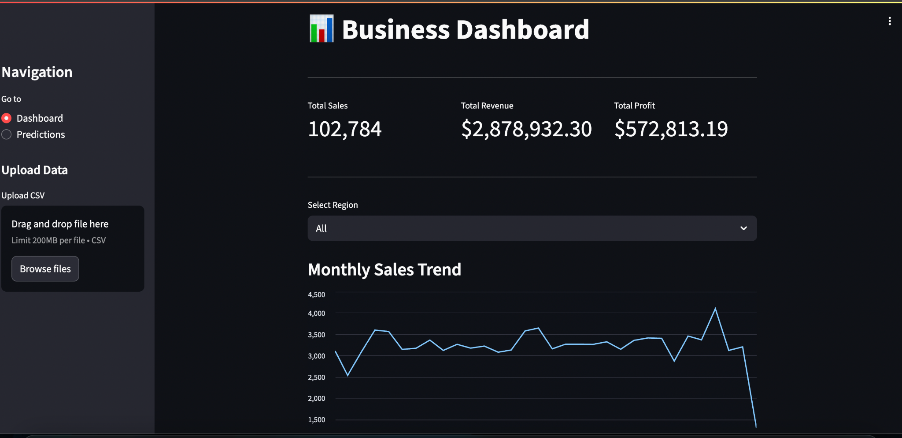
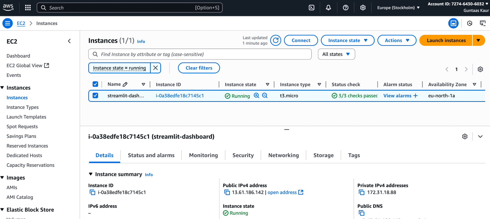
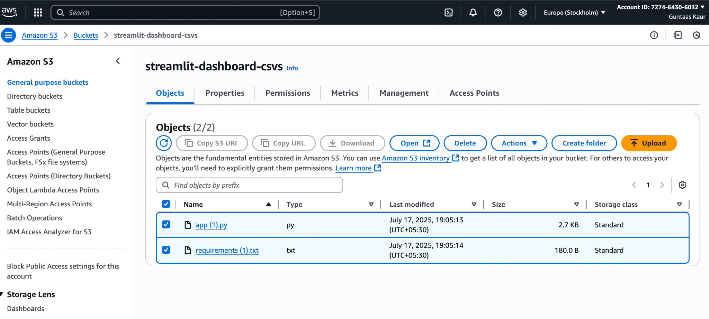

# 🌐 Cloud-Based Financial Analytics Dashboard

Welcome to my **Cloud-Based Financial Analytics Dashboard** project! 🚀  

This project is built with:
- **Streamlit** (interactive dashboard)
- **AWS EC2** (cloud hosting)
- **AWS S3** (secure data storage)
- **Prophet** (forecasting)

📊 The dashboard allows users to:
- Upload CSV financial datasets
- Store & retrieve data securely from AWS S3
- Visualize trends and revenue performance
- Run forecasting on sales and revenue

---

## 🔗 Links
- 📂 **GitHub Repository**: [Cloud-financial-dashboard](https://github.com/guntaaskaur31/Cloud-financial-dashboard)  
- 🖥️ **Live Dashboard (AWS EC2)**: [Click Here](http://your-ec2-public-ip:8501)  

---

## 📸 Screenshots
  
  
  

---

✨ Made with ❤️ by **Guntaas Kaur**

